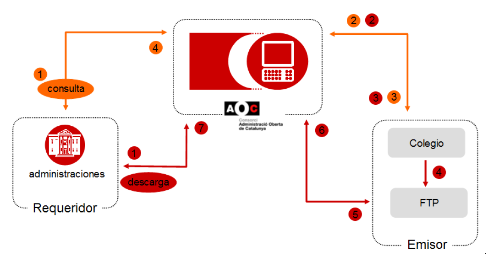
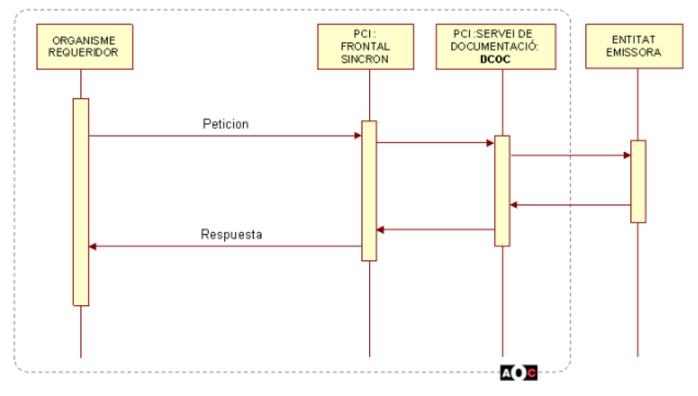
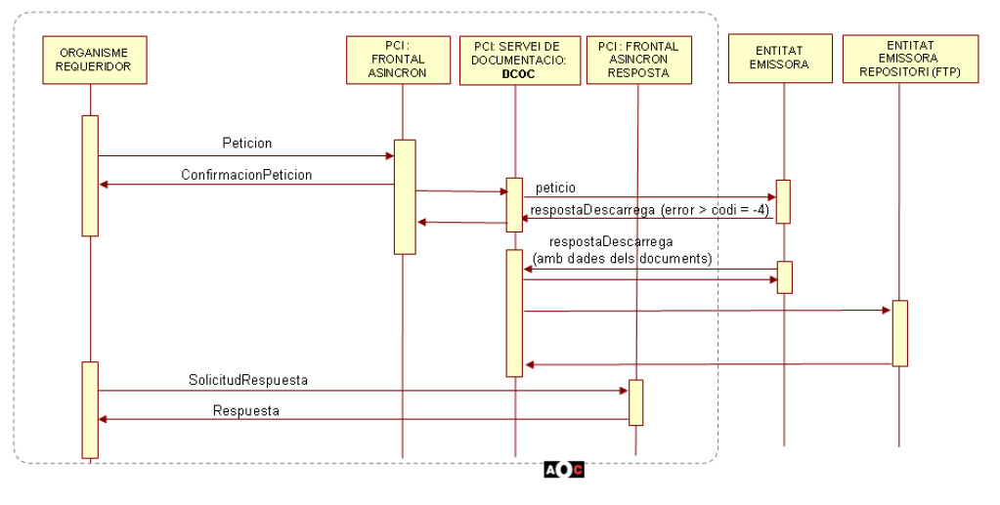
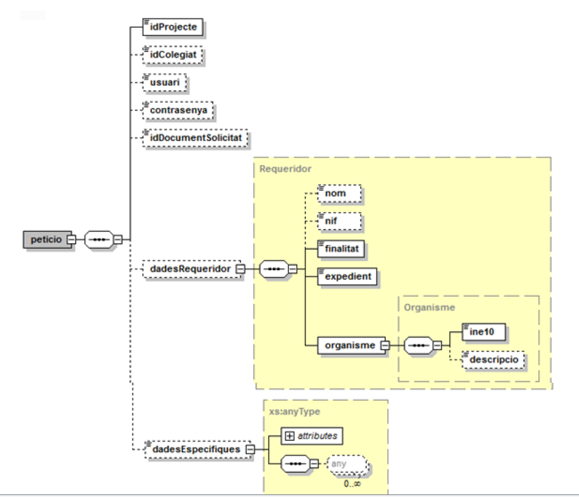
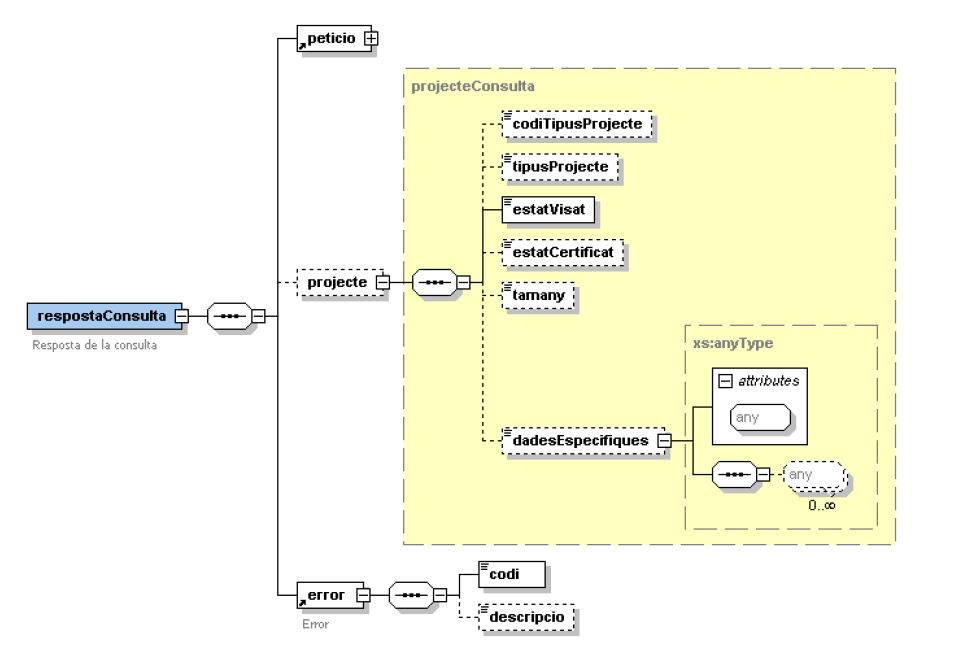
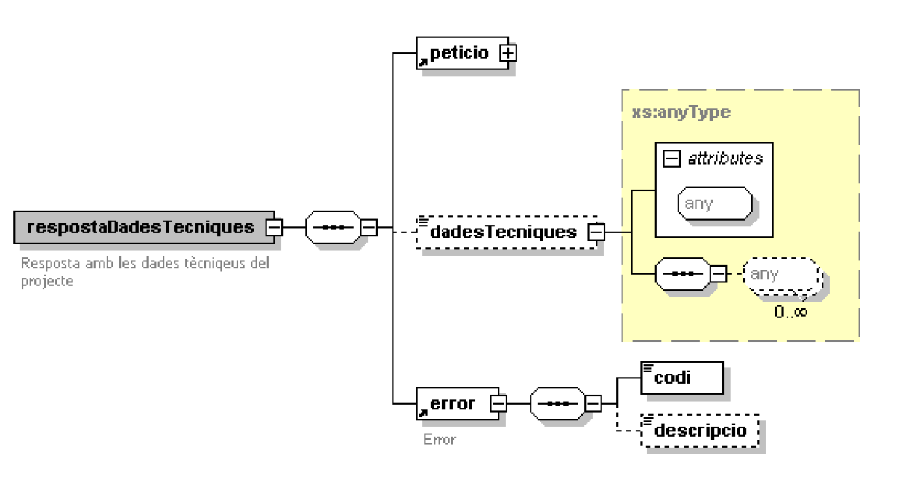
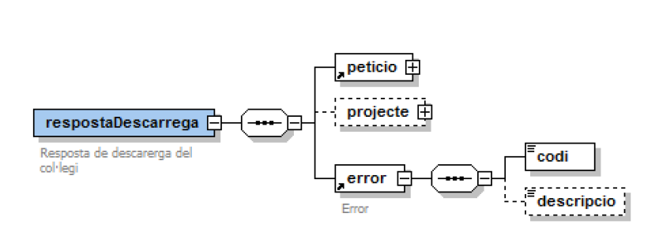
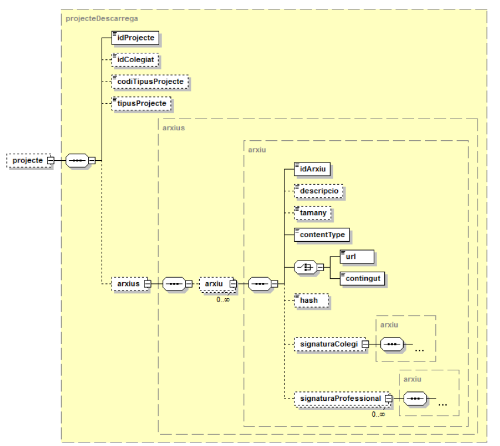
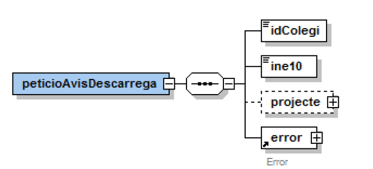
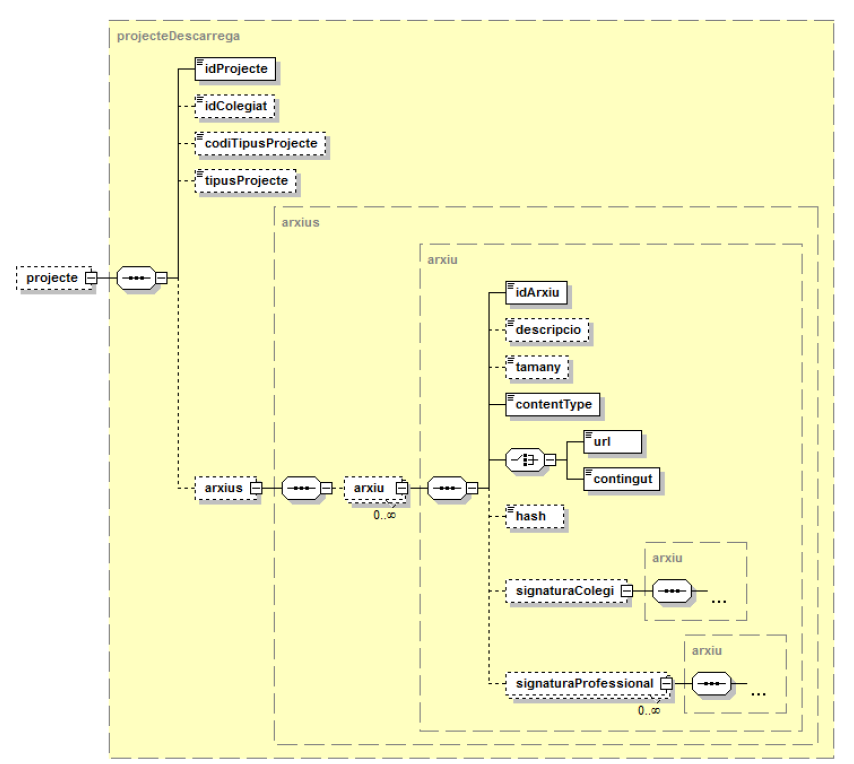

# Via Oberta – DCOC Emissors
Document d’integració pels col·legis professionals

Podreu trobar els WSDL's del serveis a implementar en aquest repositori sota el directori [/WSDL](https://github.com/ConsorciAOC/VO-DCOC-Emissors/tree/main/WSDL).


# Índex

- [1. Introducció](#1)
- [2.  Servei publicat per DCOC (AOC) : Avis de descàrrega](#2)
- [3. Missatgeria dels serveis a implementar pel col·legi](#3)
   * [3.1. Consulta](#3.1)
   * [3.2. Dades tècniques](#3.2)
   * [3.3. Descàrrega](#3.3)
   		* [3.3.1 Mode síncron](#3.3.1)
		* [3.3.1 Mode asíncron](#3.3.2)
- [4. Annex – exemple de missatges](#4)

# 1. Introducció <a name="1"></a>

Aquest document analitza les tasques i la missatgeria a implementar per part dels col·legis amb l'objectiu d'integrar-se amb el servei de Documentació dels Col·legis Oficials de Catalunya, a partir d'ara DCOC.


## 1.1 Descripció del servei DCOC  <a name="1.1"></a>

El servei DCOC facilita a les administracions (requeridors) serveis per a que aquestes puguin obtenir documentació visada electrònicament pels col·legis (emissor), així com conèixer si el document està visat electrònicament pel col·legi o no. Aquesta documentació, actualment, pot ser projectes o certificats, etc. Els certificats que es posen a disposició depèn, òbviament, del col·legi.

Es vol posar de manifest, que el Consorci AOC actua de ‘missatger’ entre emissor i requeridor. Això vol dir que la integritat i veracitat de la informació depèn exclusivament del col·legi

En la figura següent, es mostra el flux complert de les accions de consulta de l’estat i la descàrrega d’un document



### 1.1.1 Consulta / Consulta de dades tècniques  <a name="1.1.1"></a>

A continuació es detalla el diagrama de seqüència de la operació:




1. El requeridor realitza la petició al servei DCOC
2. DCOC, desprès de tractar el missatge, envia la petició al col·legi destinatari.
3. El col·legi respon a la petició.
4. DCOC, recull la resposta del col·legi, i l’entrega al requeridor sense fer cap procés sobre l’estat del projecte que envia el col·legi.


### 1.1.2 Descàrrega <a name="1.1.2"></a>



1. El requeridor realitza la petició al servei DCOC.
2. DCOC, desprès de tractar el missatge, envia la petició al col·legi destinatari.
3. El col·legi respon a la petició.
4. El col·legi diposita la documentació requerida, a una area de descàrrega FTP, fora de la seva DMZ i accesible pel Consorci.
5. El col·legi, informa al DCOC de la disponibilitat dels arxius mitjançant la invocació del corresponent servei web (Avís de descàrrega).
6. El DCOC inicia la descàrrega dels documents en funció dels valors que ha indicat el col•legi a l’entorn del Consorci.
7. El requeridor obté la ruta on es troba el document descarregat al Consorci AOC
El Consorci AOC, a través de la plataforma de col·laboració interadministrativa ( a partir d’ara PCI ) publica per al requeridor un frontal únic de missatgeria, que actua com orquestador de les diferents missatgeries o frontals entre Requeridor <-> DCOC <-> Emissor.


# 2. Servei publicat per DCOC (AOC) : [Avis de descàrrega] (https://github.com/ConsorciAOC/VO-DCOC-Emissors/blob/main/WSDL/avisDescarrega.wsdl) <a name="2"></a>

El DCOC publica un servei per a que el col·legi pugui informar de la finalització del procés de copia dels arxius de la DMZ cap al repositori amb visibilitat. Aquest servei reb un missatge de tipus peticioAvisDescarrega amb les dades enviades pel col·legi.

Aquest servei està accessible a traves de les següents URLs:
* Entorn de producció
	* `https://serveis3.iop.aoc.cat/CAOC-PCI30-MC-DCOC/AvisDescarrega`
* Entorn de pre-producció Avis Descarrega
	*  `https://serveis3-pre.iop.aoc.cat/CAOC-PCI30-MC-DCOC/AvisDescarrega`


# 3. Missatgeria dels serveis a implementar pel col·legi : [Col·legi de referència] (https://github.com/ConsorciAOC/VO-DCOC-Emissors/blob/main/WSDL/referencia.wsdl) <a name="3"></a>

En aquesta secció del document s’analitzen els serveis que interactuen entre un col·legi professional i el DCOC. Cal implementar 3 operacions (consulta, descàrrega i consulta de dades tècniques). Es pot descarregar el contracte (WSDL) que han de complir es troba al següent [enllaç](https://github.com/ConsorciAOC/VO-DCOC-Emissors/blob/main/WSDL/referencia.wsdl)

En totes les operacions el missatge de petició serà el mateix:



A continuació es detallen els blocs:

| _Element_ | _Descripció_ |
| --- | --- |
| /peticio/idProjecte | Identificador del projecte que l'usuari vol sol·licitar.|
| /peticio/idColegiat | Identificador del col·legiat que ha visat el projecte .|
| /peticio/usuari | Usuari d'entrada al sistema de dades del col·legi. (En cas que el col·legi vulgui aplicar un factor de seguretat a la propia crida XML)|
| /peticio/contrasenya | Contrasenya d'entrada al sistema de dades del col·legi. (En cas que el col·legi vulgui aplicar un factor de seguretat a la propia crida XML)|
| /peticio/idDocumentSolicitat | Identificador deltipus de document que es vol sol·licitar (només aplica per l'operació de dades tècniques) .|
| /peticio/dadesRequeridor/* | Bloc on especificar les dades del requeridor que fa la consulta .|
| //dadesRequeridor/nom | Bloc on especificar les dades del requeridor que fa la consulta .|
| //dadesRequeridor/nif | Bloc on especificar les dades del requeridor que fa la consulta .|
| //dadesRequeridor/finalitat | Finalitat amb la que es realitza la petició. Ha d'estar donada d'alta al SIRI d'AOC. |
| //dadesRequeridor/expedient | Número expedient. Serveix com a dada d'auditoria en cas de ser necessari. |
| //dadesRequeridor/organisme | Bloc per especificar les dades de l'organisme que fa la consulta.|
| //dadesRequeridor/organisme/ine10 | Codi INE10 de l'organisme. |
| //dadesRequeridor/organisme/descripcio | Descripció de l'organisme. | 
| //peticio/dadesEspecifiques | Bloc de tipus 'anyType' que permet afegir informació extra a la petició. |


## 3.1 Consulta <a name="3.1"></a>

Aquesta operació _síncrona_ permetrà que el col·legi informi si un determinat projecte es troba visat telemàticament. Els possibles estats son:

* VISAT TELEMATICAMENT
* NO VISAT TELEMATICAMENT
* NO AUTORITZAT
* EN TRÀMIT




| _Element_ | _Descripció_ |
| --- | --- |
| //respostaConsulta/peticio | Subelement de tipus petició. Correcpont al bloc de petició que s'ha enviat al col·legi.|
| //respostaConsulta/error/codi | Codi d’error. En cas de resposta correcta el valor serà 0.|
| //respostaConsulta/error/descripcio | Descripció de l'error.|
| //respostaConsulta/projecte/codiTipusProjecte | Codi del tipus de projecte. Aquest valor s’informa si l'emissor classifica els projectes visats amb un codi.|
| //respostaConsulta/projecte/tipusProjecte | Descripció del tipus de projecte. Aquest valor s’informa si l'emissor classifica els projectes visats amb una descripció.|
| //respostaConsulta/projecte/estatVisat | Indica si el projecte està visat o no. Els valors seran <b>VISAT TELEMATICAMENT, NO VISAT TELEMATICAMENT,NO AUTORITZAT</b> o <b>EN TRÀMIT</b>. Els projectes no existents no es consideraràn com un cas d’error sino que es consideraran com a que el seu estatVisat es NO VISAT TELEMATICAMENT |
| //respostaConsulta/projecte/estatCertificat | Indica si el projecte te certificat d'idoneïtat. Els valors els determinarà el propi col·legi emissor.|
| //respostaConsulta/projecte/tamany | Grandària total del projecte (en bytes).|
| //respostaConsulta/projecte/dadesEspecifiques | Bloc de tipus 'anyType' que serveix per a indicar qualsevol informació 'extra' que vulgui afegir el col·legi.|


#### 3.2 Dades tècniques <a name="3.2"></a>

Operació _síncrona_ que posarà a disposició dels requeridors -en format XML- tota aquella informació de dades tècniques que considerin oportunes.



| _Element_ | _Descripció_ |
| --- | --- |
| //respostaDadesTecniques/peticio | Subelement de tipus petició. Correcpont al bloc de petició que s'ha enviat al col·legi.|
| //respostaDadesTecniques/projecte | Subelement de tipus petició. Correcpont al bloc de petició que s'ha enviat al col·legi.|
| //respostaDadesTecniques/error/codi | Codi d’error. En cas de resposta correcta el valor serà 0.|
| //respostaDadesTecniques/error/descripcio | Descripció de l'error.|
| //respostaDadesTecniques/ | Camp de tipus 'anyType' amb la informació de les dades tècniques. Es un bloc "lliure" i serà responsabilitat de cada col·legi el format del mateix en funció de la informació que es vulgui traslladar als requeridors. |


## 3.3 Descàrrega <a name="3.3"></a>

Aquesta oepració posarà a disposició dels requeridors tota la documentció relacionada amb l'identificador de projecte sol·licitat. Es tracta d'una operació que es pot implementar de manera _síncrona_ però també _asíncrona_. Aquest segon tipus d'integració s'explicarà a l'apartat [3.3.2](#3.3.2)






| _Element_ | _Descripció_ |
| --- | --- |
| /respostaDescarrega/peticio | Subelement de tipus petició. Correcpont al bloc de petició que s'ha enviat al col·legi.|
| /respostaDescarrega/error/codi | Codi d’error. En cas de resposta correcta el valor serà 0.|
| /respostaDescarrega/error/descripcio | Descripció de l'error.|
| /respostaDescarrega/projecte | Bloc amb la informació dels documents que formen part del projecte visat.<br/><b>IMPORTANT: si no ve informat aquest bloc, serà necessari enviar la informació via callback al servei d'avis de descàrrega. Més informació al següent [apartat](#3.3.2)</b> |
| //projecte/idProjecte | Identificador del projecte. |
| //projecte/idColegiat | Identificador del col·legiat que ha visat el projecte. |
| //projecte/codiTipusProjecte | Codi del tipus de projecte. Aquest valor s’informa si l'emissor classifica els projectes visats amb un codi. |
| //projecte/tipusProjecte | Descripció del tipus de projecte. Aquest valor s’informa si l'emissor classifica els projectes visats amb una descripció. |
| //projecte/arxius/arxiu | Informació dels diferents arxius que formen part del projecte. |
| //arxiu/idArxiu | Bloc amb els diferents arxius que formen part del projecte. |
| //arxiu/descripcio | Bloc amb els diferents arxius que formen part del projecte. |
| //arxiu/tamany | Grandària de l’arxiu (en bytes). |
| //arxiu/contentType | MimeType del arxiu. Ex:  `text/xml`, `application/pdf`... |
| //arxiu/url | Path relatiu al fitxer per descarregar. |
| //arxiu/contingut | Certificat en format XML, si s’escau. |
| //arxiu/signaturaColegi | Subelement de tipus arxiu. Com a màxim hi haurà 1 signatura que correspon a la del col·legi que visa el document. |
| //arxiu/signaturaProfessional | Subelement de tipus arxiu. Correspon a la signatura del document per part d’un professional(qui visa el projecte) |


A continuació es detallen els possibles codis d’error:

* _-3_: El col·legi emissor no autoritza la descàrrega del projecte. Disposarà del bloc `error/descripcio` per a detallar el motiu.
* _-2_: Projecte NO VISAT Telemàticament
* _0_: Sense error. 
* _>0_ : Error. La codificació dels diferents errors dependrà del col·legi. Disposarà del bloc `error/descripcio` per a detallar-la.


Per a la descàrrega dels documents, serà necessari que el col·legi faciliti a AOC les credencials de l'SFTP on s'haurà de connectar el DCOC. Les dades que es necessiten son:

* Host: host de l'SFTP
* Port: port de l'SFTP
* Usuari: usuari d'accés
* Contrasenya: contrasenya d'accés
* Homedir: Directori a partir del cual es trobaran disponibles els fitxers, si s'escau.

## 3.3.1. Mode "síncron": facilitar dades de resposta "immediatament" <a name="3.3.1"></a>

En aquest mode síncron, la resposta del col·legi amb les dades del projecte visat s'afegirà al bloc `/respostaDescarrega/projecte/arxius/arxiu` de la resposta.


## 3.3.2. Mode "asíncron": facilitar dades de resposta via servei d'avís de descàrrega <a name="3.3.2"></a>

Aquesta opció permet als col·legis indicar al DCOC el moment en el que es troba disponible la documentació a l'SFTP per a poder-la descarregar. Aquesta opció podria ser interessant quan la grandària dels documents es molt pesada, amb la intenció d'evitar errors quan des del DCOC es vulguin descarregar documents.

<b>Per a fer efectiva aquesta opció, només serà necessari retornar una resposta de descarrega amb `/respostaDescarrega/error/codi`= 0 i sense el bloc `/respostaDescarrega/projecte`</b>. DCOC deixarà la petició de DCOC en  `stand-by` fins rebre la informació del projecte mitjançant el servei de callback d'AvisDescarrega.

Els endpoints estan especificats a l'apartat [Avis de descàrrega](#2)

## 3.3.2.1. Petició



El bloc de projecte, es el mateix de la resposta de descàrrega:



| _Element_ | _Descripció_ |
| --- | --- |
| /peticioAvisDescarrega/error/codi | Codi d’error. En cas de resposta correcta el valor serà 0. En cas d'error, el codi > 0. |
| /peticioAvisDescarrega/error/descripcio | Descripció de l'error.|
| /peticioAvisDescarrega/projecte | Bloc amb la informació dels documents que formen part del projecte visat.<br/><b>IMPORTANT: si no ve informat aquest bloc, serà necessari enviar la informació via callback al servei d'avis de descàrrega. Més informació al següent [apartat](3.3.2)</b> |
| //projecte/idProjecte | Identificador del projecte. |
| //projecte/idColegiat | Identificador del col·legiat que ha visat el projecte. |
| //projecte/codiTipusProjecte | Codi del tipus de projecte. Aquest valor s’informa si l'emissor classifica els projectes visats amb un codi. |
| //projecte/tipusProjecte | Descripció del tipus de projecte. Aquest valor s’informa si l'emissor classifica els projectes visats amb una descripció. |
| //projecte/arxius/arxiu | Informació dels diferents arxius que formen part del projecte. |
| //arxiu/idArxiu | Bloc amb els diferents arxius que formen part del projecte. |
| //arxiu/descripcio | Bloc amb els diferents arxius que formen part del projecte. |
| //arxiu/tamany | Grandària de l’arxiu (en bytes). |
| //arxiu/contentType | MimeType del arxiu. Ex:  `text/xml`, `application/pdf`... |
| //arxiu/url | Path relatiu al fitxer per descarregar. |
| //arxiu/contingut | Certificat en format XML, si s’escau. |
| //arxiu/signaturaColegi | Subelement de tipus arxiu. Com a màxim hi haurà 1 signatura que correspon a la del col·legi que visa el document. |
| //arxiu/signaturaProfessional | Subelement de tipus arxiu. Correspon a la signatura del document per part d’un professional(qui visa el projecte) |


## 3.3.2.2. Resposta

La resposta bàsicament ens indicarà si tot ha anat OK (`error = 0`) o si hi ha hagut algun error en el missatge que s'ha enviat (`error > 0`)


# 4. Annex - Exemple de missatges <a name="4"></a>

A continuació es mostren alguns exemples:

## 4.1. Petició

```
<?xml version="1.0" encoding="UTF-8"?>
<peticio xmlns="http://aoc.cat/dcoc/cocref"
         xmlns:xsi="http://www.w3.org/2001/XMLSchema-instance">
	<idProjecte>102752-526</idProjecte>
	<idColegiat>96292</idColegiat>
	<dadesRequeridor>
		<nom>Jaume Garcia Garcia</nom>
		<finalitat>FINALITAT</finalitat>
		<expedient>EXPEDIENT</expedient>
		<organisme>
			<ine10>0123456789</ine10>
			<descripcio>CAOC</descripcio>
		</organisme>
	</dadesRequeridor>
</peticio>
```

## 4.2. Resposta consulta

```
<?xml version="1.0" encoding="UTF-8"?>
<respostaConsulta xmlns="http://aoc.cat/dcoc/cocref"
                  xmlns:xsi="http://www.w3.org/2001/XMLSchema-instance">
	<peticio xmlns=http://aoc.cat/dcoc/cocref
	         xmlns:xsi="http://www.w3.org/2001/XMLSchema- instance">
		<idProjecte>102752-526</idProjecte>
		<idColegiat>96292</idColegiat>
		<dadesRequeridor>
			<nom>Jaume Garcia Garcia</nom>
			<finalitat>FINALITAT</finalitat>
			<expedient>EXPEDIENT</expedient>
			<organisme>
				<ine10>0123456789</ine10>
				<descripcio>CAOC</descripcio>
			</organisme>
		</dadesRequeridor>
	</peticio>
	<projecte>
		<codiTipusProjecte>3</codiTipusProjecte>
		<tipusProjecte>Obra publica</tipusProjecte>
		<estatVisat>VISAT TELEMATICAMENT</estatVisat>
		<estatCertificat> CERTIFICAT FAVORABLE </estatCertificat>
	</projecte>
	<error>
		<codi>0</codi>
		<descripcio/>
	</error>
</respostaConsulta>
```

## 4.3. Resposta dades tècniques

En aquest cas el bloc de dades tècniques de CHU (Certificat Habitabilitat Urbanisme)

```
<?xml version="1.0" encoding="UTF-8"?>
<respostaDadesTecniques xmlns="http://aoc.cat/dcoc/cocref">
   <peticio>
      <idProjecte>PRJ-CAATT-123234</idProjecte>
      <dadesRequeridor>
         <finalitat>AUTOLLIC</finalitat>
         <organisme>
            <ine10>7977100006</ine10>
            <descripcio>Agència de l'habitatge de catalunya</descripcio>
         </organisme>
      </dadesRequeridor>
   </peticio>
   <ns2:dadesTecniques xmlns:ns2="http://aoc.cat/dcoc/cocref">
      <dadesTecniques xmlns="http://www.apatgn.org/dcoc/dadesTecniquesCHU">
         <tecnicRedactor>
            <nom>JOAN</nom>
            <cognom1>GARCIA PEREZ</cognom1>
            <cognom2/>
            <tipusDocument>NIF</tipusDocument>
            <Document>99887766Z</Document>
            <tipusTecnic>Arquitecte Tècnic</tipusTecnic>
         </tecnicRedactor>
         <numPlantes>0</numPlantes>
         <usActual/>
         <usProposat/>
         <superficieTotalEdifici>0,00</superficieTotalEdifici>
         <superficieSobreRasant>0,00</superficieSobreRasant>
         <superficieSotaRasant>0,00</superficieSotaRasant>
         <alcadaSobreRasant>0,00</alcadaSobreRasant>
         <alcadaSotaRasant>0,00</alcadaSotaRasant>
         <superficieNP/>
         <superficieAM/>
         <superficieRF/>
         <numTotalHabitatges>0</numTotalHabitatges>
         <numHabitatgesNP/>
         <numHabitatgesRF/>
         <numHabitatgesPO>0</numHabitatgesPO>
         <numHabitatgesLloguer/>
         <numLocalsComercials/>
         <numPlacesAparCotxes/>
         <numPlacesAparMotos/>
         <numPlacesResidencia/>
         <numAltresLocals/>
         <placesHoteleres/>
         <pressupost>0,00</pressupost>
         <importDipositResidus/>
         <Dades_CHU>
            <tipusDocument_CHU>CERTIFICAT D'HABITABILITAT DE SEGONA OCUPACIÓ</tipusDocument_CHU>
            <nif_sollicitant>99887766Z</nif_sollicitant>
            <nom_sollicitant>JOAN GARCIA PEREZ</nom_sollicitant>
            <adreca_sollicitant>Avinguda de Catalunya, Nº 136</adreca_sollicitant>
            <codi_postal_sollicitant>43700</codi_postal_sollicitant>
            <poblacio_sollicitant>Vendrell, El</poblacio_sollicitant>
            <telefon_sollicitant>678000001</telefon_sollicitant>
            <telefon2_sollicitant/>
            <email_sollicitant>jgperez@elmeucorreu.cat</email_sollicitant>
            <com_a_propietari>false</com_a_propietari>
            <com_a_altres>true</com_a_altres>
            <modalitat_de_recollida_presencial>true</modalitat_de_recollida_presencial>
            <modalitat_de_recollida_correu>false</modalitat_de_recollida_correu>
            <nif_propietari>11223345E</nif_propietari>
            <nom_propietari>Maria José Euros Dubidu</nom_propietari>
            <adreca_propietari>Carrer Pau Casals, Nº 29 Piso 2</adreca_propietari>
            <codi_postal_propietari>43700</codi_postal_propietari>
            <poblacio_propietari>VENDRELL, EL</poblacio_propietari>
            <persona_inspeccio_propietari>Cristina Palau</persona_inspeccio_propietari>
            <telefon_contacte_inspeccio>629862919</telefon_contacte_inspeccio>
            <localitat_sollicitant>El Vendrell</localitat_sollicitant>
            <data_sollicitut>20240205</data_sollicitut>
            <servei_territorial_Barcelona>false</servei_territorial_Barcelona>
            <servei_territorial_Girona>false</servei_territorial_Girona>
            <servei_territorial_Lleida>false</servei_territorial_Lleida>
            <servei_territorial_Tarragona>true</servei_territorial_Tarragona>
            <servei_territorial_Terres>false</servei_territorial_Terres>
            <ajuntament_ok>false</ajuntament_ok>
            <ajuntament/>
            <consell_comarcal_ok>false</consell_comarcal_ok>
            <consell_comarcal/>
            <numero_collegiat>01316</numero_collegiat>
            <collegi_collegiat>COAAT DE TARRAGONA</collegi_collegiat>
            <nom_collegiat>JOAN GARCIA PEREZ</nom_collegiat>
            <numero_comprovacio>COAATT-XX-12345</numero_comprovacio>
            <titulacio_collegiat>Arquitecte Tècnic</titulacio_collegiat>
            <nivell_annex>ANNEX 2</nivell_annex>
            <decret>DCT/141/2012</decret>
            <primera_ocupacio>false</primera_ocupacio>
            <num_primera_ocupacio/>
            <segona_ocupacio>true</segona_ocupacio>
            <num_segona_ocupacio>CHT006423230000</num_segona_ocupacio>
            <sense_cedula>false</sense_cedula>
            <documents_antiguitat/>
            <prova_assaig>false</prova_assaig>
            <annex_fotografic_documental>false</annex_fotografic_documental>
            <municipi_habitatge>Vendrell, El</municipi_habitatge>
            <codi_ine_municipi_habitatge>43163</codi_ine_municipi_habitatge>
            <codi_postal_habitatge>43700</codi_postal_habitatge>
            <localitat_barri_habitatge/>
            <tipus_via_habitatge>CARRER</tipus_via_habitatge>
            <nom_via_habitatge>JACINT DE LES MUNTANYES</nom_via_habitatge>
            <numero_habitatge>187</numero_habitatge>
            <poligon_habitatge/>
            <km_habitatge/>
            <illa_habitatge/>
            <sector_habitatge/>
            <parcella_habitatge/>
            <adreca_complementaria_habitatge/>
            <unifamiliar_habitatge>false</unifamiliar_habitatge>
            <plurifamiliar_habitatge>true</plurifamiliar_habitatge>
            <bloc_habitatge/>
            <escala_habitatge/>
            <pis_casa_habitatge/>
            <porta_habitatge/>
            <duplex_triplex_habitatge/>
            <referencia_cadastral_habitatge>7777777CF1111A5678PL</referencia_cadastral_habitatge>
            <escala_pis_porta_habitatge>3</escala_pis_porta_habitatge>
            <e_m_habitatge>1</e_m_habitatge>
            <h_5_8_habitatge>1</h_5_8_habitatge>
            <h_8_12_habitatge>2</h_8_12_habitatge>
            <h_12_habitatge>0</h_12_habitatge>
            <c_habitatge>1</c_habitatge>
            <ch_habitatge>1</ch_habitatge>
            <e_m_c_habitatge>0</e_m_c_habitatge>
            <altres_peces_habitatge>1</altres_peces_habitatge>
            <superficie_util_habitatge>667,75</superficie_util_habitatge>
            <ocupacio_maxima_habitatge>8</ocupacio_maxima_habitatge>
            <localitat_habitatge/>
            <data_habitatge/>
         </Dades_CHU>
      </dadesTecniques>
   </ns2:dadesTecniques>
   <error>
      <codi>0</codi>
      <descripcio>NO hi ha error. Procés executat sense incidències. Document trobat.</descripcio>
   </error>
</respostaDadesTecniques>

```

## 4.4. Resposta descàrrega mode "síncron"

```
<?xml version="1.0" encoding="UTF-8"?>
<respostaDescarrega xmlns="http://aoc.cat/dcoc/cocref"
                    xmlns:xsi="http://www.w3.org/2001/XMLSchema-instance">
	<peticio xmlns="http://aoc.cat/dcoc/cocref"
	         xmlns:xsi="http://www.w3.org/2001/XMLSchema-instance">
		<idProjecte>102752-526</idProjecte>
		<idColegiat>96292</idColegiat>
		<dadesRequeridor>
			<nom>Jaume Garcia Garcia</nom>
			<finalitat>FINALITAT</finalitat>
			<expedient>EXPEDIENT</expedient>
			<organisme>
				<ine10>0123456789</ine10>
				<descripcio>CAOC</descripcio>
			</organisme>
		</dadesRequeridor>
	</peticio>
	<projecte>
		<idProjecte>102752-526</idProjecte>
		<codiTipusProjecte>3</codiTipusProjecte>
		<tipusProjecte>Obra publica</tipusProjecte>
		<arxius>
			<arxiu>
				<idArxiu>23255641-111</idArxiu>
				<descripcio>Descripcio</descripcio>
				<tamany>3456421</tamany>
				<contentType>application/pdf</contentType>
				<url>/102752/23255641-111.pdf</url>
			</arxiu>
		</arxius>
	</projecte>
	<error>
		<codi>0</codi>
		<descripcio/>
	</error>
</respostaDescarrega>
```

## 4.5. Resposta descàrrega mode "asíncron"

```
<?xml version="1.0" encoding="UTF-8"?>
<respostaDescarrega xmlns="http://aoc.cat/dcoc/cocref"
                    xmlns:xsi="http://www.w3.org/2001/XMLSchema-instance">
	<peticio xmlns="http://aoc.cat/dcoc/cocref"
	         xmlns:xsi="http://www.w3.org/2001/XMLSchema-instance">
		<idProjecte>102752-526</idProjecte>
		<idColegiat>96292</idColegiat>
		<dadesRequeridor>
			<nom>Jaume Garcia Garcia</nom>
			<finalitat>FINALITAT</finalitat>
			<expedient>EXPEDIENT</expedient>
			<organisme>
				<ine10>0123456789</ine10>
				<descripcio>CAOC</descripcio>
			</organisme>
		</dadesRequeridor>
	</peticio>
	<error>
		<codi>0</codi>
	</error>
</respostaDescarrega>
```


## 4.6. Petició Avis descàrrega (amb adjunts de tipus XML)

```
<?xml version="1.0" encoding="UTF-8"?>
<peticioAvisDescarrega xmlns="http://aoc.cat/dcoc/cocref"
                       xmlns:xsi="http://www.w3.org/2001/XMLSchema-instance">
	<idColegi>COAC</idColegi>
	<ine10>0123456789</ine10>
	<projecte>
		<idProjecte>12344-526</idProjecte>
		<codiTipusProjecte>3</codiTipusProjecte>
		<tipusProjecte>Obra publica</tipusProjecte>
		<arxius>
			<arxiu>
				<idArxiu>12345-526</idArxiu>
				<descripcio>Descripcio</descripcio>
				<tamany>12335471</tamany>
				<contentType>text/xml</contentType>
				<contingut><![CDATA[ 
										<certificado_hab>
								<ref_interna value=""
											 versiondocumento="2"/>
								<idioma value="cat"/>
								<emplazamiento cp="08396"
											   municipio="277"
											   geo_num="XXXXXXXXX"/>
								<cliente n_identificativo="NIF"/>
								<cliente n_identificativo="NIF"/>
								<arquitecto_autor nombre="43868"/>
								<arquitecto_director nombre="43868"/>
								<arquitecto_tecnico nombre="NOMBRE"/>
								<contratista nombre="NOMBRE"/>
								<descripcion_obra viviendas="1"
												  locales="0"
												  apartamentos="0"/>
								<linea>
									<situacion texto="TIPO"/>
									<numero_piezas s="1"
												   h="4"
												   c="1"
												   b="2"
												   s_c="0"
												   otras="0"/>
									<vivienda superficie_util_interior="111.68"/>
								</linea>
								<arquitecto_aparejador num_col="9368"/>
								<certifica_aparejador viviendas="1"
													  texto=""
													  ficha="FICHA">
									<localizacion_firma dia="9"
														mes="5"
														anyo="2008"/>
								</certifica_aparejador>
								<arquitecto_coac num_col="0"/>
								<certifica_coac viviendas="1"
												texto="">
									<localizacion_firma dia="9"
														mes="5"
														anyo="2008"/>
									<fecha_finalizacion dia="9"
														mes="6"
														anyo="2008"/>
								</certifica_coac>
							</certificado_hab>						
				]]></contingut>
			</arxiu>
		</arxius>
	</projecte>
	<error>
		<codi>0</codi>
		<descripcio/>
	</error>
</peticioAvisDescarrega>

```

## 4.7. Petició d'avís de descàrrega amb adjunt de tipus PDF (que es descarregarà via SFTP)

```
<?xml version="1.0" encoding="UTF-8"?>
<peticioAvisDescarrega xmlns="http://aoc.cat/dcoc/cocref"
                       xmlns:xsi="http://www.w3.org/2001/XMLSchema-instance">
	<idColegi>COAC</idColegi>
	<ine10>0123456789</ine10>
	<projecte>
		<idProjecte>44444-126</idProjecte>
		<codiTipusProjecte>3</codiTipusProjecte>
		<tipusProjecte>Obra publica</tipusProjecte>
		<arxius>
			<arxiu>
				<idArxiu>23255641-111</idArxiu>
				<descripcio>Descripcio</descripcio>
				<tamany>3456421</tamany>
				<contentType>application/pdf</contentType>
				<url>/44444/23255641-111.pdf</url>
			</arxiu>
		</arxius>
	</projecte>
	<error>
		<codi>0</codi>
		<descripcio/>
	</error>
</peticioAvisDescarrega>
```

## 4.8. Resposta avis de descàrrega

```
<?xml version="1.0" encoding="UTF-8"?>
<respostaAvisDescarrega xmlns="http://aoc.cat/dcoc/cocref" xmlns:xsi="http://www.w3.org/2001/XMLSchema-instance">
	<error>
		<codi>0</codi>
		<descripcio/>
	</error>
</respostaAvisDescarrega>

```

## 4.9. Resposta de cas d'error

A continuació es mostra un exemple de resposta de consulta, tot i que per la resta d'operacions seria pràcticament igual.

```
<?xml version="1.0" encoding="UTF-8"?>
<respostaConsulta xmlns="http://aoc.cat/dcoc/cocref" xmlns:xsi="http://www.w3.org/2001/XMLSchema-instance">
	<peticio xmlns="http://aoc.cat/dcoc/cocref" xmlns:xsi="http://www.w3.org/2001/XMLSchema- instance">
		<idProjecte>102752-526</idProjecte>
		<idColegiat>96292</idColegiat>
		<dadesRequeridor>
			<nom>Jaume Garcia Perez</nom>
			<finalitat>FINALITAT</finalitat>
			<expedient>EXPEDIENT</expedient>
			<organisme>
				<ine10>2222222222</ine10>
				<descripcio>Aj.Bns</descripcio>
			</organisme>
		</dadesRequeridor>
	</peticio>
	<error>
		<codi>1</codi>
		<descripcio>El codi de referencia del col·legiat no existeix</descripcio>
	</error>
</respostaConsulta>
```